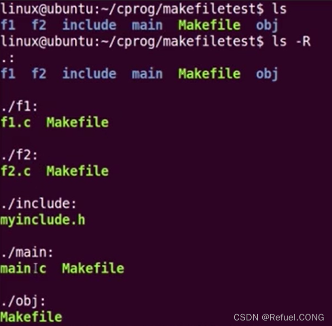
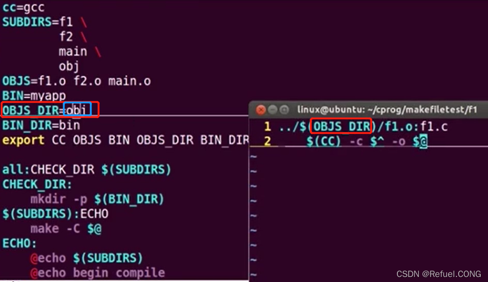
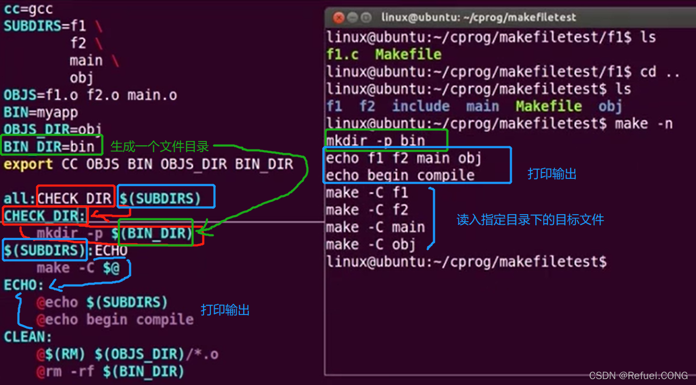

## Makefile

### 基本结构
Makefile是Make读入的唯一配置文件

由make工具创建的目标体(target)，通常是目标文件或可执行文件

要创建的目标体所依赖的文件(dependency_file)

创建每个目标体时需要运行的命令(command)

注意: 命令行前面必须是一个”TAB 键”,否则编译错误为:*** missing separator. Stop.


```
Makefile格式：

target : dependcy_files    
<TAB>command
```

target //目标 : target也就是一个目标文件，可以是Object File，也可以是执行文件。还可以是一个标签（Label）

dependcy_files //生成目标所要的目标文件: dependcy_files 就是，要生成那个target所需要的文件或是目标。

command也就是make需要执行的命令。（任意的Shell命令）

这是一个文件的依赖关系，也就是说，target这一个或多个的目标文件依赖于dependcy_files中的文件，其生成规则定义在command中。说白一点就是说，dependcy_files中如果有一个以上的文件比target文件要新的话，command所定义的命令就会被执行。这就是Makefile的规则。也就是Makefile中最核心的内容。

【注】：在看别人写的Makefile文件时，你可能会碰到以下三个变量：$@，$^，$<代表的意义分别是：

他们三个是十分重要的三个变量，所代表的含义分别是：

```
$@：目标文件，
$^: 所有的依赖文件，
$<： 第一个依赖文件。
```

复杂一些的例子：
```
sunq:kang.o yul.o
	gcc kang.o yul.o -o sunq
kang.o:kang.c kang.h
	gcc -Wall -O -g-c kang.c -o kang.o
yul.o:yul.c yul.h
	gcc -Wall -O -g-c yul.c -o yul.o
clean:
	    rm *.o test
```

注释：
—Wall : 表示允许发出gcc所有有用的报警信息。
—c : 只是编译不连接，生成目标文件" .o "
—o file : 表示把输出文件输出到file里

我们可以把这个内容保存在文件为“Makefile”或“makefile”的文件中，然后在该目录下直接输入命令“make”就可以生成执行文件sunq。如果要删除执行文件和所有的中间目标文件，那么，只要简单地执行一下“make clean”就可以了。在这个makefile中，目标文件（target）包含：执行文件sunq和中间目标文件（*.o），依赖文件（prerequisites）就是冒号后面的那些 .c 文件和 .h文件。每一个 .o 文件都有一组依赖文件，而这些 .o 文件又是执行文件 sunq的依赖文件。依赖关系的实质上就是说明了目标文件是由哪些文件生成的，换言之，目标文件是哪些文件更新的。

在定义好依赖关系后，后续的那一行定义了如何生成目标文件的操作系统命令，一定要以一个Tab键作为开头。记住，make并不管命令是怎么工作的，他只管执行所定义的命令。make会比较targets文件和dependcy_files文件的修改日期，如果dependcy_files文件的日期要比targets文件的日期要新，或者target不存在的话，那么，make就会执行后续定义的命令。

在Makefile中加.PHONY:command
.PHONY:隐含说明

“.PHONY”表示，clean是个伪目标文件。
```
.PHONY:clean
```
清空目标文件的规则
每个Makefile中都应该写一个清空目标文件（.o和执行文件）的规则，这不仅便于重编译，也很利于保持文件的清洁。
一般的风格都是：

clean:

      rm edit $(objects)
更为稳健的做法是：
```
.PHONY : clean
 clean :
 	   -rm edit $(objects)
```

前面说过，.PHONY意思表示clean是一个“伪目标”，。而在rm命令前面加了一个小减号的意思就是，也许某些文件出现问题，但不要管，继续做后面的事。 当然，clean的规则不要放在文件的开头，不然，这就会变成make的默认目标，相信谁也不愿意这样。不成文的规矩是——“clean从来都是放在文件的最后”。

### 创建和使用变量
为了makefile的易维护，在makefile中我们可以使用变量。makefile的变量也就是一个字符串，理解成C语言中的宏可能会更好。

makefile例子：
```
test:fun1.o fun2.o main.o
        gcc fun1.o fun2.o main.o -o test
fun2.o:fun2.c
        gcc -c -Wall fun2.c -o fun2.o
fun1.o:fun1.c
        gcc -c -Wall fun1.c -o fun1.o
main.o:main.c
        gcc -c -Wall main.c -o main.o
.PHONY:clean
clean
	rm *.o test
```

比如，我们声明一个变量，叫objects，能够表示obj文件就行了。我们在makefile一开始就这样定义：

```objects = fun1.o fun2.o main.o```

于是，我们就可以很方便地在我们的makefile中以“$(objects)”的方式来使用这个变量了，于是我们的改良版makefile就变成下面这个样子：

```
objects = fun1.o fun2.o main.o
test:$(objects)
        gcc fun1.o fun2.o main.o -o test
fun2.o:fun2.c
        gcc -c -Wall fun2.c -o fun2.o
fun1.o:fun1.c
        gcc -c -Wall fun1.c -o fun1.o
main.o:main.c
        gcc -c -Wall main.c -o main.
.PHONY:clean
clean
	rm *.o test
```
如何定义变量?
变量定义的两种方式
```
递归展开方式VAR=var
简单方式VAR:=var
变量使用$(VAR)
用 ” $ ” 则用 ” $$ ” 来表示
类似于编程语言中的宏
```
例如
```
sunq:kang.o yul.o
	gcc kang.o yul.o -o sunq
kang.o:kang.c kang.h
	gcc -Wall -O -g-c kang.c -o kang.o
yul.o:yul.c yul.h
	gcc -Wall -O -g-c yul.c -o yul.o
.PHONY:clean
clean
	rm *.o test
```
用变量替换
```
OBJS = kang.o yul .o
CC = gcc
CFLAGS = -Wall -O -g

sunq : $(OBJS)
	$(CC)$(OBJS) -o sunq
kang.o : kang.c kang.h
	$(CC)$(CFLAGS)-c kang.c -o kang.o
yul.o : yul.c yul.h
	$(CC)$(CFLAGS)-c yul.c -o yul.o
.PHONY:clean
clean
	rm *.o test
```

#### 定义变量的方式
简单方式VAR:=var
```
m := mm 
x:=$(m) 
y:= $(x) bar
x:=later
echo $(x) $(y)
```
用?=定义变量
```
dir :=/foo/bar
FOO?=bar
FOO是？
```
?含义是，如果FOO没有被定义过，那么变量FO0的值就是“bar”，如果FOO先前被定义过，那么这条语将什么也不做，其等价于:
```
ifeq ($(origin FOO),undefined) 
       FOO=bar 
endif
```
为变量添加值
可以通过 += 为已定义的变量添加新的值
```
Main=hello.o hello-1.o 
Main+=hello-2.o
```
这三个变量十分常见且重要
```
$@：目标文件，$^: 所有的依赖文件，$<： 第一个依赖文件
```
```
objects = fun1.o fun2.o main.o
test:$(objects)
        gcc fun1.o fun2.o main.o -o test
fun2.o:fun2.c
        gcc -c -Wall fun2.c -o fun2.o
fun1.o:fun1.c
        gcc -c -Wall fun1.c -o fun1.o
main.o:main.c
        gcc -c -Wall main.c -o main.o
.PHONY:clean
clean
	rm *.o test
```
修改变量
```
objects = fun1.o fun2.o main.o
CFLAGS=-c -Wall

test:$(objects)
        gcc  $(objects) -o test
fun2.o:$<
        gcc $(CFLAGS) fun2.c -o $@
fun1.o:$<
        gcc $(CFLAGS) fun1.c -o $@
main.o:$<
        gcc $(CFLAGS) main.c -o $@
.PHONY:clean
clean
	rm *.o test
```

## Makefile 总述
Makefile里主要包含了五个东西：显式规则、隐晦规则、变量定义、文件指示和注释。

显式规则。显式规则说明了，如何生成一个或多的的目标文件。这是由Makefile的书写者明显指出，要生成的文件，文件的依赖文件，生成的命令。

隐晦规则。由于我们的make有自动推导的功能，所以隐晦的规则可以让我们比较粗糙地简略地书写Makefile，这是由make所支持的。

变量的定义。在Makefile中我们要定义一系列的变量，变量一般都是字符串，这个有点你C语言中的宏，当Makefile被执行时，其中的变量都会被扩展到相应的引用位置上。

文件指示。其包括了三个部分，一个是在一个Makefile中引用另一个Makefile，就像C语言中的include一样；另一个是指根据某些情况指定Makefile中的有效部分，就像C语言中的预编译#if一样；还有就是定义一个多行的命令。有关这一部分的内容，我会在后续的部分中讲述。

注释。Makefile中只有行注释，和UNIX的Shell脚本一样，其注释是用“#”字符，这个就像C/C++中的“//”一样。如果你要在你的Makefile中使用“#”字符，可以用反斜框进行转义，如：“#”。

## VPATH的用法
### 1. Makefile的 VPATH
VPATH: 虚路径

在一些大的工程中，有大量的源文件，我们通常的做法是把这许多的源文件分类，并存放在不同的目录中。所以，当make需要去找寻文件的依赖关系时，你可以在文件前加上路径，但 最好的方法是把一个路径告诉make，让make在自动去找。

Makefile文件中的特殊变量“VPATH”就是完成这个功能的，如果没有指明这个变量，make只会在当前的目录中去找寻依赖文件和目标文件。如果定义了这个变量，那么，make就会在当当前目录找不到的情况下，到所指定的目录中去找寻文件了。

VPATH = src:../headers

上面的的定义指定两个目录，“src”和“../headers”，make会按照这个顺序进行搜索。目录由“冒号”分隔。(当然，当前目录永远是最高优先搜索的地方)

另一个设置文件搜索路径的方法是使用make的“vpath”关键字（注意，它是全小写的），这不是变量，这是一个make的关键字，这和上面提到的那个VPATH变量很类似，但是它更为灵活。它可以指定不同的文件在不同的搜索目录中。这是一个很灵活的功能。它的使用方法有三种：

```
1. vpath < pattern> < directories>     
 //为符合模式< pattern>的文件指定搜索目录<directories>。

2. vpath < pattern>                              
 //清除符合模式< pattern>的文件的搜索目录。

3.  vpath                                                 
 //清除所有已被设置好了的文件搜索目录。
```

vapth使用方法中的< pattern>需要包含“%”字符。“%”的意思是匹配零或若干字符，例如，“%.h”表示所有以“.h”结尾的文件。< pattern>指定了要搜索的文件集，而< directories>则指定了的文件集的搜索的目录。例如：

```
 vpath %.h ../headers
```
我们可以连续地使用vpath语句，以指定不同搜索策略。如果连续的vpath语句中出现了相同的< pattern>，或是被重复了的< pattern>，那么，make会按照vpath语句的先后顺序来执行搜索。如：
```
vpath %.c foo

vpath % blish

vpath %.c bar

其表示“.c”结尾的文件，先在“foo”目录，然后是“blish”，最后是“bar”目录。

vpath %.c foo:bar

vpath % blish
而上面的语句则表示“.c”结尾的文件，先在“foo”目录，然后是“bar”目录，最后才是“blish”目录。
```

### 2.嵌套的Makefile
每个文件都一个自己的makefile，makefile互相调用子makefile

我们看到有许多目录和外部makefile，在每个目录下有.c程序和子makefile



在第一个目录f1中的子makefile是把f1.c 生成为f1.o放到了OBJS_DIR obj中




我们注意到有一句@echo $(SUBDIRS)

@(RM)并不是我们自己定义的变量，那它是从哪里来的呢? 就是make -f

make -C $@

export CC OBJS BIN OBJS_DIR BIN_DIR ：是让子makefile也可以调用

Ref: https://www.cnblogs.com/yikoulinux/p/16240563.html