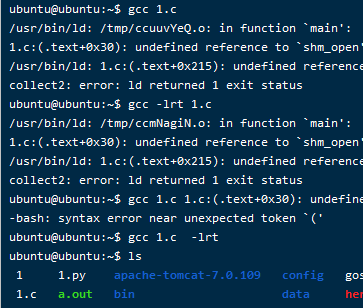

```
#include <fcntl.h>
#include <stdio.h>
#include <stdlib.h>
#include <sys/mman.h>
#include <sys/stat.h>
#include <unistd.h>
static char *args[] = {
    "hic et nunc",
    "-l",
    "/dev/shm",
    NULL
};
extern char **environ;
int main(void) 
{
    struct stat st;
    void *p;
    int fd, shm_fd, rc;
    shm_fd = shm_open("wurstverschwendung", O_RDWR | O_CREAT, 0777);
    if (shm_fd == -1) {
    perror("shm_open");
    exit(1);
    }
    rc = stat("/bin/ls", &st);
    if (rc == -1) {
    perror("stat");
    exit(1);
    }
    rc = ftruncate(shm_fd, st.st_size);
    if (rc == -1) {
    perror("ftruncate");
    exit(1);
    }
    p = mmap(NULL, st.st_size, PROT_READ | PROT_WRITE, MAP_SHARED,
         shm_fd, 0);
    if (p == MAP_FAILED) {
    perror("mmap");
    exit(1);
    }
    fd = open("/bin/ls", O_RDONLY, 0);
    if (fd == -1) {
    perror("openls");
    exit(1);
    }
    rc = read(fd, p, st.st_size);
    if (rc == -1) {
    perror("read");
    exit(1);
    }
    if (rc != st.st_size) {
    fputs("Strange situation!\n", stderr);
    exit(1);
    }
    munmap(p, st.st_size);
    close(shm_fd);
    shm_fd = shm_open("wurstverschwendung", O_RDONLY, 0);
    fexecve(shm_fd, args, environ);
    perror("fexecve");
    return 0;
}
```
编译的时候使用gcc -lrt不然会报错，提示找不到shm_open的符号
```
gcc test.c -o test -lrt
```


运行以后可以看到执行了ls，当然我们去/dev/shm下也能够看到这个文件，和memfd一模一样我们能够在bash中执行这个二进制


Ref:https://xeldax.top/article/linux_no_file_elf_mem_execute